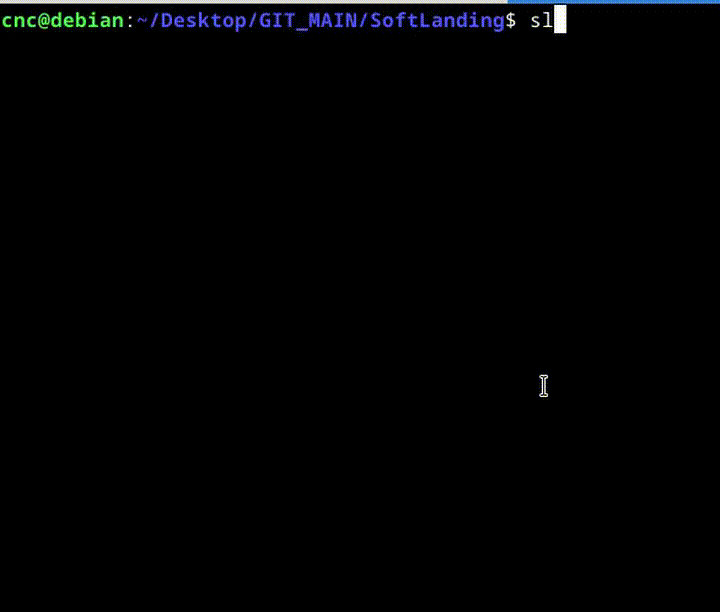

# SoftLanding
Soft Landing is a terminal command that mimics the behavior of the sl command.


## Why did I create the SoftLanding command?

I want to pray every day for Williams and Wilmore, that they return safely to Earth.

While working, I often mistype "sl," and when I do, the Steam Locomotive animation appears.

I want to change that to "SoftLanding" for Williams and Wilmore—so I can pray every minute, even while I'm working.

That's why I created this SoftLanding project.


## Follow these steps to bring our project to life

```
mkdir build

cd build

cmake ..

make

sudo make install
```


## You can add the alias to your .bashrc with this single line command
```
echo "alias sl='softlanding'" >> ~/.bashrc && source ~/.bashrc
```


**`Soft Landing animation :`**




## To convert a video to a GIF
```
ffmpeg -i l.mkv -vf "fps=10,scale=720:-1:flags=lanczos" -c:v gif output.gif
```
